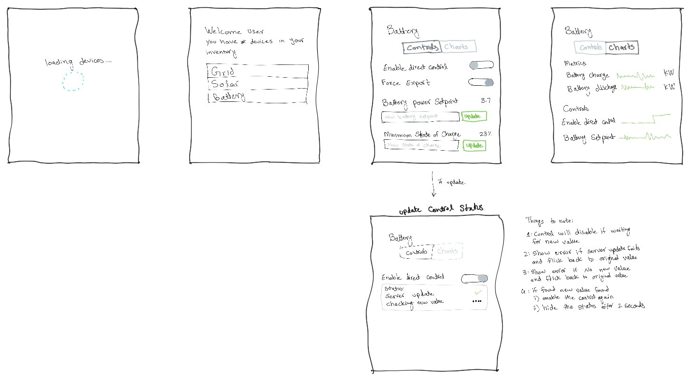

# SwitchDin Front-End Skill Test

This is a simple project to test your front-end development skills. The project
consists of a server that provides a REST API and a WebSocket API to interact
with devices. Your task is to implement a front-end client that interacts with
the server.

Detailed instructions should have been provided to you by the person who
assigned you this test. If you have any questions, please reach out to them.

## Pre-requisites

- Node.js (Any recent version should work. Tested with v18.20.3)

## Running the server

```
cd components/server
npm run start
```

## Implementing a front-end client

### UI Mockup



### Note

Your front-end should be implemented in the `components/client` directory. You
can use any front-end framework you like.

### Steps

1. Download the code for this repository
2. Implement a front-end client
3. Zip the project with your changes and email it to your hiring manager

-----

# API Documentation

## Base URL

```
<http://localhost:3000>
```

## Endpoints

### Get All Devices

#### URL: `/api/v1/devices/`

#### Method: `GET`

#### Response:

```json
[
  {
    "id": "string",
    "name": "string",
    "controls": [
      {
        "key": "string",
        "name": "string",
        "type": "boolean" | "number",
        "value": "boolean" | "number" | "null"
      }
    ],
    "metrics": [
      {
        "key": "string",
        "name": "string",
        "unit": "string"
      }
    ]
  }
]
```

### Get Device by ID

#### URL: `/api/v1/devices/:deviceId`

#### Method: `GET`

#### URL Params:

```
deviceId=[string]
```

#### Response:

```json
{
  "id": "string",
  "name": "string",
  "controls": [
    {
      "key": "string",
      "name": "string",
      "type": "boolean" | "number",
      "value": "boolean" | "number" | "null"
    }
  ],
  "metrics": [
    {
      "key": "string",
      "name": "string",
      "unit": "string"
    }
  ]
}
```

### Update Device

#### URL: `/api/v1/devices/:deviceId`

#### Method: `POST`

#### URL Params:

```
deviceId=[string]
```

#### Request Body:

```json
{
  "controls": [
    {
      "key": "string",
      "value": "boolean" | "number" | "null"
    }
  ]
}
```

#### Response:

```json
{
  "message": "string"
}
```

## WebSocket Server Documentation

### WebSocket URL

```
ws://localhost:3001
```

### Subscribing to a Device

#### Message:

```json
{
  "type": "subscribe",
  "deviceId": "string"
}
```

#### Response:

```
None
```

### Unsubscribing from a Device

#### Message:

```json
{
  "type": "unsubscribe",
  "deviceId": "string"
}
```

#### Response:

```
None
```

### Receiving Device Data

#### Message:

```json
{
  "deviceId": "string",
  "measurements": [
    {
      "metric": "string",
      "value": "boolean" | "number" | "null"
    }
  ]
}
```
